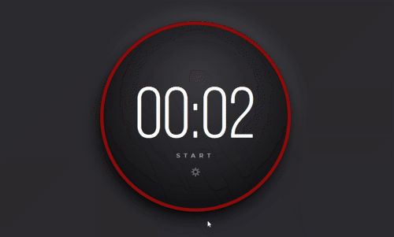

# Day 1 - Pomodoro Timer

## Overview

These are the starter files and a suggested solution to the Pomodoro Timer.
You can find more details about the challenge by [logging into Podia.](https://store.selfteach.me/login)

## Challenge

Within the _STARTER-FILES_ folder, you'll find everything you need to get started.

Users should be able to:

- Start and Stop the Timer
- Click on the gear icon to change the length (minutes and seconds) for the timer.

## Demo

Live Demo: [GitHub Pages](https://nilstarbb.github.io/advent-of-js/1-pomodoro-timer/index-REACT.html)

Tutorial: [#1 Pomodoro Timer (React.js) - Advent of JS](https://tech.randomwaves.space/posts/21-12-30-1-pomodoro-timer-reactjs-advent-of-js/)

with progress bar:

without progress bar:

