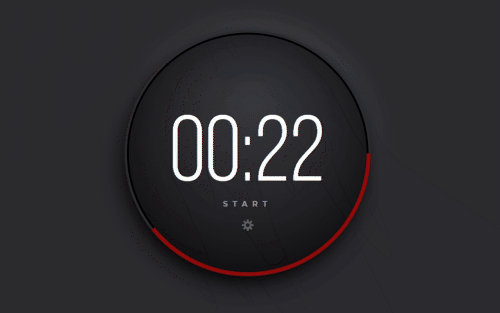
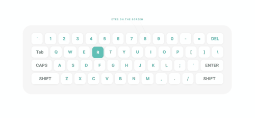
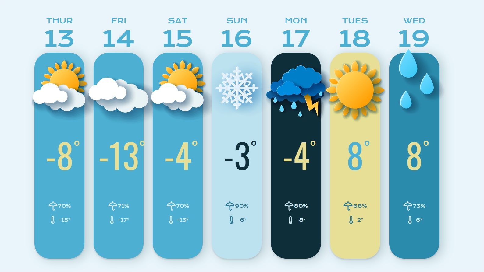
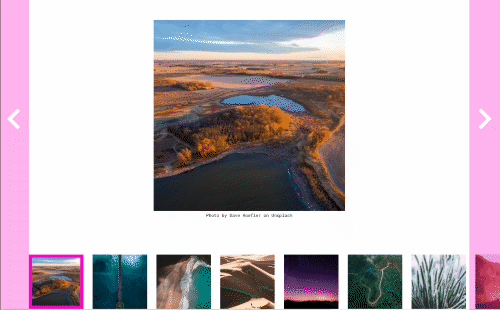
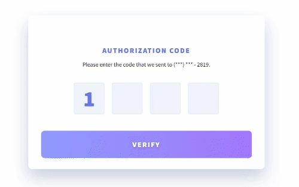
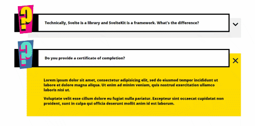
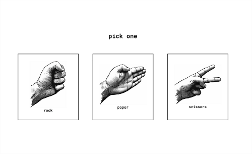

# Advent of JavaScript

- [Advent of JavaScript](#advent-of-javascript)
  - [1 - Pomodoro Timer](#1---pomodoro-timer)
  - [2 - eCommerce Component](#2---ecommerce-component)
  - [3 - Piano Keyboard](#3---piano-keyboard)
  - [4 - Computer Keyboard](#4---computer-keyboard)
  - [5 - Multiple Checkboxes](#5---multiple-checkboxes)
  - [6 - Range Slider](#6---range-slider)
  - [7 - Tip Calculator](#7---tip-calculator)
  - [8 - Weather API](#8---weather-api)
  - [9 - Image Carousel](#9---image-carousel)
  - [10 - 4 Digit Code](#10---4-digit-code)
  - [11 - Accordions](#11---accordions)
  - [12 - Rock, Paper, Scissors](#12---rock-paper-scissors)
  - [13 - Custom Modal](#13---custom-modal)
  - [14 - Calendar Picker](#14---calendar-picker)

## 1 - Pomodoro Timer 

[Live Demo](https://nilstarbb.github.io/advent-of-js/1-pomodoro-timer/index-REACT.html) | [Code](https://github.com/nilstarbb/advent-of-js/tree/main/1-pomodoro-timer) | [Tutorial](https://tech.randomwaves.space/posts/21-12-30-1-pomodoro-timer-reactjs-advent-of-js/)

Users should be able to:

- Start the timer by clicking on the start link/button.
- Once the user clicks start, the word start will change to stop. Then, the user can click on the stop button to make the timer stop.
- Click on the gear icon to change the length (minutes and seconds) of the timer.
- Once the timer finishes, the ring should change from green to red and an alert message is passed to the browser.

## 2 - eCommerce Component 

[Live Demo](https://nilstarbb.github.io/advent-of-js/2-eCommerce-component/index-REACT.html) | [Code](https://github.com/nilstarbb/advent-of-js/tree/main/2-eCommerce-component) | [Tutorial](https://tech.randomwaves.space/posts/22-01-06-2-ecommerce-component-reactjs-advent-of-js/)

Users should be able to:

- View the plates on the left side of the screen and add them to your cart on the right side.
- When there are no plates within your cart, you should see a message that says, "Your cart is empty."
- When a plate is added to your cart, the Subtotal and Totals will automatically update.
- When products are in your cart, you should be able to increase and decrease the quantity. 
    - A user should not be able to mark the quantity as a negative number.
    - If the quantity goes down to 0, the user will have the option to delete or remove the product from their cart entirely.
- Tax is based on the state of Tennessee sales tax: 0.0975

## 3 - Piano Keyboard

[Live Demo](https://nilstarbb.github.io/advent-of-js/3-piano-keyboard/index.html) | [Code](https://github.com/nilstarbb/advent-of-js/tree/main/3-piano-keyboard) | [Tutorial](https://tech.randomwaves.space/posts/22-01-07-3-piano-keyboard-advent-of-js/)

Users should be able to:

- See the keyboard centered on the page
- Whenever a user hovers over a specific key it will change colors 
  - White keys will change to yellow #ffd200
  - Black keys will change to pink #f40082
- When a user clicks on a specific key, it will play an audio clip. 
  - The audio clips are numbered, but I did not specifically number the keys. You can pick which key should be associated with each audio file.
  - If a user clicks on one key, then immediately clicks on a second key. The 2 files should both play. Meaning, clicking on one key will not stop an existing audio file from playing. 

## 4 - Computer Keyboard

[Live Demo](https://nilstarbb.github.io/advent-of-js/4-computer-keyboard/index.html) | [Code](https://github.com/nilstarbb/advent-of-js/tree/main/4-computer-keyboard) | [Tutorial](https://tech.randomwaves.space/posts/22-01-07-04-computer-keyboard-advent-of-js/)

Users should be able to:

- See the computer keyboard centered on the page
- A random letter will start to jiggle.
- The user should type the same key that's jiggling and it will stop.
- A new, random key will start jiggling

## 5 - Multiple Checkboxes

[Live Demo](https://nilstarbb.github.io/advent-of-js/5-multiple-checkboxes/index.html) | [Code](https://github.com/nilstarbb/advent-of-js/tree/main/5-multiple-checkboxes) | [Tutorial](https://tech.randomwaves.space/posts/22-01-08-5-multiple-checkboxes-advent-of-js/)

Users should be able to:

- See the list of podcast episodes
- Check one episode, shift click (use ctrl instead) to select all the episodes in between

## 6 - Range Slider

[Live Demo](https://nilstarbb.github.io/advent-of-js/6-range-slider/index.html) | [Code](https://github.com/nilstarbb/advent-of-js/tree/main/6-range-slider) | [Tutorial](https://tech.randomwaves.space/posts/22-01-08-6-range-slider-advent-of-js/)

Users should be able to: 

- Move the knob on the range and the dollar amount above it will update.

## 7 - Tip Calculator

[Live Demo](https://nilstarbb.github.io/advent-of-js/7-tip-calculator/index.html) | [Code](https://github.com/nilstarbb/advent-of-js/tree/main/7-tip-calculator) | [Tutorial](https://tech.randomwaves.space/posts/22-01-13-7-tip-calculator-advent-of-js/)

Users should be able to: 

- calculate tip based on tip percentage, bill amount, and number of people

## 8 - Weather API

[Live Demo](https://nilstarbb.github.io/advent-of-js/8-weather-api/index-REACT.html) | [Code](https://github.com/nilstarbb/advent-of-js/tree/main/8-weather-api) | [Tutorial](https://tech.randomwaves.space/posts/22-01-14-8-weather-api-advent-of-js/)

Users should be able to:

- view weather for the upcoming week

## 9 - Image Carousel

[Live Demo](https://nilstarbb.github.io/advent-of-js/9-image-carousel/index-REACT.html) | [Code](https://github.com/nilstarbb/advent-of-js/tree/main/9-image-carousel) | [Tutorial](https://tech.randomwaves.space/posts/22-01-14-9-image-carousel-advent-of-js/)

Users should be able to: 

- toggle left and right through the image thumbnails
- click an image to select it manually

## 10 - 4 Digit Code

[Live Demo](https://nilstarbb.github.io/advent-of-js/10-4-digit-code/index.html) | [Code](https://github.com/nilstarbb/advent-of-js/tree/main/10-4-digit-code) | [Tutorial](https://tech.randomwaves.space/posts/22-01-27-10-four-digit-code-advent-of-js/)

Users should be able to: 

- type in a digit and automatically be taken to the next input
- paste in a 4 digit code

## 11 - Accordions

[Live Demo](https://nilstarbb.github.io/advent-of-js/11-accordions/index.html) | [Code](https://github.com/nilstarbb/advent-of-js/tree/main/11-accordions) | [Tutorial](https://tech.randomwaves.space/posts/22-04-11-11-accordions-advent-of-js/)

Users should be able to: 

- Click on a collapsed question to expand it and view the answer.
- Click on a collapsed answer to collapse it and hide the answer.

## 12 - Rock, Paper, Scissors

[Live Demo](https://nilstarbb.github.io/advent-of-js/12-rock-paper-scissors/index.html) | [Code](https://github.com/nilstarbb/advent-of-js/tree/main/12-rock-paper-scissors) | [Tutorial](https://tech.randomwaves.space/posts/22-04-12-12-rock-paper-scissors-advent-of-js/)

Users should be able to: 

- play the game and see the results

## 13 - Custom Modal

[Live Demo](https://nilstarbb.github.io/advent-of-js/13-custom-modal/index.html) | [Code](https://github.com/nilstarbb/advent-of-js/tree/main/13-custom-modal) | [Tutorial](https://tech.randomwaves.space/posts/22-04-13-13-custom-modal-advent-of-js/)

Users should be able to: 

- Click on a point on the image, that triggers the modal
- Click on the x within the modal to close the modal

## 14 - Calendar Picker

[Live Demo](https://nilstarbb.github.io/advent-of-js/14-calendar-picker/index.html) | [Code](https://github.com/nilstarbb/advent-of-js/tree/main/14-calendar-picker) | [Tutorial](https://tech.randomwaves.space/posts/22-04-14-14-calendar-picker-advent-of-js/)

Users should be able to: 

- view calendar with correct days with the current day highlighted
- navigate through different months

<!--  -->